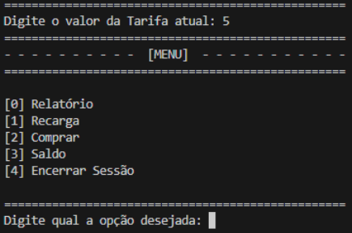
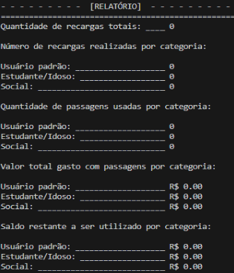
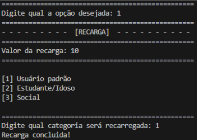
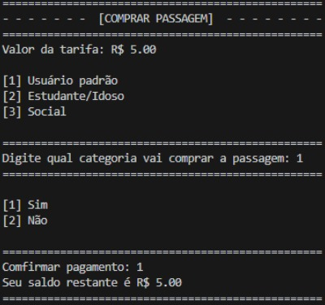
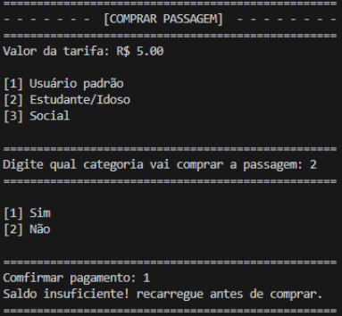
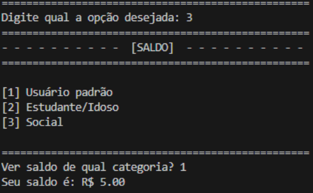
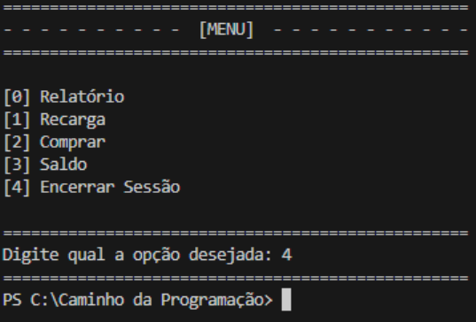

# Sistema de Bilhetagem de Transporte Público

**_Abstract._** This report aims to clarify the process of development of the “Public Transport Ticketing System” for the city of TechVille, created with the Python programming language. The goal is to modernize the management of recharges, purchases, balances and reports. Furthermore, the system must be able to recognize categories and check if the user has sufficient balance based on the ticket value to board transport.  

**_Resumo._** Este relatório tem como finalidade esclarecer o processo de desenvolvimento do “Sistema de Bilhetagem de Transporte Público” para a cidade de TechVille, criado com a linguagem de programação Python. O objetivo é modernizar o gerenciamento de recargas, compras, saldos e relatórios. Além disso, o sistema deve ser capaz de reconhecer categorias e verificar se o usuário tem saldo suficiente, com base no valor da passagem, para embarcar no transporte.  

## 1. Introdução  

A humanidade ao longo da história sempre buscou se organizar em grupos para se proteger, obter recursos e se desenvolver. Nessa perspectiva, evoluíram gradualmente para organizações mais complexas, originando as cidades, caracterizadas pela concentração populacional e pelo desenvolvimento de atividades econômicas. Em decorrência do crescimento urbano, a locomoção se tornou um fator imprescindível na sociedade, uma vez que esta é dinâmica e está em constante movimento. Para resolver essa dificuldade, tornou-se necessária a implementação dos transportes públicos.  

Uma das principais vantagens desse meio de transporte é a acessibilidade que ele proporciona aos indivíduos no âmbito social, como, por exemplo, o deslocamento diário para o trabalho ou a escola. De acordo com a pesquisa realizada pela Confederação Nacional de Municípios (CNM, 2015), nos municípios com mais de 100 mil habitantes, 55% da população dependia do transporte público para se locomover.  

A cidade de TechVille em decorrência do desenvolvimento precisa modernizar o seu sistema de transportes públicos, com base nesse sentido, surgiu a necessidade da criação de um programa que calcula automaticamente os saldos dos cartões de transporte dos usuários, registre recargas, realize descontos na passagem de acordo com as categorias e verifique se o saldo é suficiente para realizar o embarque.  

O algoritmo a princípio será composto por três categorias principais, usuário padrão que pagará a totalidade do valor da tarifa, o estudante/idoso pagará meia passagem e o social 20% do valor da passagem. O “Sistema de Bilhetagem de Transporte Público” tem como finalidade melhorar o gerenciamento de dados, utilizando a linguagem de programação Python, através dela será possível desenvolver a logística que atenda ao solicitado pela cidade. Em primeira análise, o programa deve ser capaz de configurar na inicialização o valor da passagem e, logo em seguida, exibir as opções, que incluem relatório, recarga, compra, saldo e encerrar a sessão, na utilização do programa será possível alternar entre as diferentes funções utilizando os laços de repetições e as estruturas condicionais. Em suma, o código desenvolvido em Python é capaz de executar funções essenciais para o transporte público, não se limitando apenas à cidade de TechVille, tendo como base a sua fundamentação prática no uso diário da população.  

Nesse sentido, esse relatório tem como finalidade explicar o processo de desenvolvimento do algoritmo responsável por realizar recargas, compras, verificar saldo e exibir relatórios, abordando a metodologia, resultados e discussões, além do detalhamento das soluções e do manual de uso do programa.  

## 2. Metodologia  

Durante as sessões tutoriais foi indiscutível a necessidade da utilização dos laços de repetição e as estruturas condicionais, já que, o programa deve armazenar e executar as funções desejadas sem interrupções durante o uso. Deste modo, o código é fundamentado no desenvolvimento do menu interativo que interpreta as entradas do usuário e realiza as funções correspondentes às disponíveis nos itens de navegação, como exibir relatório, recarregar, comprar, consultar saldo e encerrar sessão. Para o desenvolvimento do algoritmo foram criadas variáveis específicas para cada tipo de situação, uma vez que, a qualquer momento o administrador pode consultar essas informações, dentre elas a quantidade de recarga total, o número de recargas realizadas por cada usuário/categoria, quantidade de passagens usadas, valor total gasto com passagens e o saldo restante a ser utilizado. Nesse sentido, o programa foi desenvolvido com essa proposta, a fim de gerenciar as alterações nos valores das variáveis ao longo do processo de recarga e compra de passagens, utilizando laços de repetições e estruturas condicionais.  

Sendo assim, os laços de repetição são comandos que permitem a repetição de blocos de códigos várias vezes, enquanto a condição para sua inicialização for verdadeira, em virtude disso, eles desempenham um papel fundamental no sistema. Nesse sentido, os laços foram os primeiros a serem desenvolvidos no programa, pois possibilitam a criação do menu funcional que permanece ativo até o usuário escolher sair, visto que, a cada ciclo o usuário é questionado sobre qual ação será executada em seguida de acordo com a interpretação das estruturas condicionais.  

Dessa forma, para garantir a repetição, um loop principal foi construído sobre a perspectiva que a condição de sua inicialização fosse verdadeira. Com base nessa lógica, qualquer entrada diferente das opções disponíveis fará o código se repetir até que o usuário digite uma opção válida. Ou seja, só é possível finalizar o código selecionando a opção de encerrar sessão, pois, nesse caso, a condição de inicialização é falsa.  

Com isso, as estruturas condicionais são responsáveis por interpretar a entrada do usuário e tomar decisões com base em condições, permitindo a seleção de diferentes funções e a organização da estrutura do código. Cada condição resulta em uma ação específica, garantindo a qualidade dos dados armazenados para o preenchimento do relatório.  

Além disso, quando o usuário solicita a ação de recarga, ele insere o valor desejado, em seguida, informa a categoria. Dessa maneira, o valor da recarga é somado ao saldo do usuário e registrado no relatório. Ao realizar a ação de compra de passagens, o saldo disponível considerando os possíveis descontos é comparado com o valor da passagem definido no início do código. Se for suficiente, o embarque é autorizado, o valor da passagem é subtraído do saldo e a transação é registrada no relatório. Caso contrário, o sistema informa que o saldo é insuficiente.  

Em conclusão, este software foi criado em Python 3.13.1 e desenvolvido no sistema operacional Windows, da Microsoft, dentro de um ambiente de desenvolvimento integrado (IDE). Para a programação, foi utilizado o Visual Studio Code (VS Code), um editor de código também desenvolvido pela Microsoft. Apesar de ter sido desenvolvido no Windows, o software pode ser executado no sistema operacional Linux.  

## 3. Resultados e discussões  

Nesta sessão, serão apresentadas informações referentes ao manual de uso, garantindo a utilização correta do sistema e destacando pontos importantes, como, por exemplo, dados de entrada e erros solucionados.  

### 3.1. Manual de uso  

Para rodar o programa, é essencial que um interpretador Python esteja instalado no computador. Abaixo está um guia passo a passo para a execução do sistema:  

1. Abra o interpretador Python.  
2. Acesse, no interpretador, o diretório onde o código-fonte está salvo.  
3. Execute o código.  

Logo em seguida, quando o programa é inicializado é solicitado a entrada do valor da passagem, depois disso é exibido o menu de navegação, onde os números correspondem às funções que podem ser usadas pelo usuário, como visto na Figura 1.  
 

**Figura 1. Itens de navegação**  

As opções disponíveis incluem o Relatório, Recarga, Comprar, Saldo e Encerrar Sessão. O programa permanecerá em execução, a menos que o usuário selecione a opção de saída. Para encerrá-lo, é necessário ser digitado o número 4. Caso seja inserido um valor inválido, o sistema solicitará novamente que o usuário escolha uma opção válida. Se a opção do usuário for igual a zero as estruturas condicionais irão encaminhá-lo para o relatório, onde constará com os dados salvos nas variáveis, conforme observado na Figura 2.

 

**Figura 2. Relatório**  

Na opção 1, o usuário vai inserir o valor da recarga desejada e a categoria, depois disso o valor será atribuído no saldo específico, tal como percebido na Figura 3.  

 

**Figura 3. Opção de Recarga**  

Na opção 2, o usuário poderá comprar a passagem. Neste bloco de comando, o sistema exibirá o valor da passagem e perguntará qual categoria o usuário deseja selecionar. Antes de seu saldo ser subtraído, o usuário terá a opção de confirmar o pagamento. O processo segue a mesma lógica do menu principal, onde cada número representa uma categoria específica. Com isso, o sistema aplicará o desconto correspondente e verificará se o saldo disponível na categoria permite o embarque. Caso contrário, uma mensagem será exibida informando que é necessário recarregar antes de prosseguir, de acordo com o que se nota na Figura 4.  

 

**Figura 4. Compra confirmada**

Se o saldo do usuário for inferior ao valor da passagem, será necessário realizar uma recarga antes da compra, como evidenciado na Figura 5.  

 

**Figura 5. Saldo insuficiente para embarcar**  

Na opção 3, os usuários podem consultar seus saldos inserindo a categoria, tal como se vê na Figura 6.  

 

**Figura 6. Consultar saldo**  

Na opção 4, o programa será interrompido devido a condição criada para seu funcionamento, enquanto a variável “on” possuísse valor igual a 0, os blocos iriam se repetir, entretanto, na opção 4 essa variável tem seu valor alterado para 1, dando fim ao ciclo da repetição, de maneira visível na Figura 7.  

 

**Figura 7. Encerramento do programa**  

### 3.2. Dados de entrada  

O principal tipo de entrada de dado tratado neste programa é o ponto flutuante (números decimais) utilizado para definir o valor da passagem e da recarga. Para evitar erros ao processar essas entradas, foram implementadas validações. Para garantir que o usuário insira valores válidos, foi utilizado o método try-except. Esse método permite que o programa detecte e trate erros, como o ValueError, que ocorre quando um valor inválido é digitado (por exemplo, letras em vez de números). Dessa forma, enquanto o usuário não inserir um valor correto, o programa continuará solicitando a entrada, evitando falhas e garantindo a continuidade da execução.  

### 3.3. Erros  

No que se refere aos erros do programa, os principais problemas estavam na validação das entradas do tipo inteiro e ponto flutuante, já que a inserção inadequada de dados quebrava o programa, retornando erros como o TypeError, que ocorre quando há operações incompatíveis entre tipos, e o ValueError, provocado pela conversão de uma string para um tipo numérico. Dessa forma, para que o programa se mantivesse funcional, foi necessário implementar validações que repetiam a pergunta até que o tipo de entrada fosse compatível com o programa, ou seja, enquanto o tipo de dado não fosse o adequado, o usuário continuaria inserindo-o. A solução encontrada para essa problemática foi a utilização do método try-except combinado com um loop, visto que ele sinaliza que aquele bloco pode gerar algum tipo de erro, resolvendo, assim, os problemas do programa.  

## 4. Conclusão  

Em suma, este relatório contém os principais pontos do desenvolvimento do Sistema de Bilhetagem de Transporte Público, todas as implementações solicitadas foram alcançadas, dentre elas, exibir relatório, gerenciar saldos, recarregar, comprar passagem e verificar se é possível embarcar e encerrar o programa, além disso, foram adicionadas outras funções, como, por exemplo, todas as validações e o confirmamento da compra de passagem antes de embarcar no transporte.  

No que tange às melhorias, é possível citar o armazenamento de dados mesmo após o fim da execução e a possibilidade de alterar o valor da tarifa sem precisar fechar o programa.  

### Referências  
Confederação Nacional de Municípios (CNM). Boa parte da população brasileira gasta mais de uma hora por dia no trânsito. Brasília, 14 out. 2015. Disponível em: https://cnm.org.br/comunicacao/noticias/boa-parte-da-populacao-brasileira-gasta-mais-de-uma-hora-por-dia-no-transito. Acesso em: 19 mar. 2025.  

PROFESSOR JUST. Python #17 - Exceções. 1 de jun. de 2020. Vídeo. Disponível em: https://youtu.be/EitneQGNbaA?si=gYZ8e8EFBDdq5gOF. Acesso em: 30 mar. 2025.  

