# O jogo da Vida

**_Abstract._** _This report aims to explain the development process, using the Python programming language version 3.13.1, of the implementation of the "Game of Life", originally created by mathematician John Conway. The game simulates the dynamics of life through a set of rules, in which cells arranged on a board interact with each other, being able to live, die, or reproduce, generating different generations according to the initial conditions established._  

**_Resumo._** _Este relatório tem como objetivo esclarecer o processo de desenvolvimento, na linguagem de programação Python versão 3.13.1, da implementação do "Jogo da Vida", originalmente criado pelo matemático John Conway. O jogo simula a dinâmica da vida por meio de regras, nas quais as células dispostas em um tabuleiro interagem entre si, podendo viver, morrer ou se reproduzir, originando diferentes gerações conforme as condições iniciais estabelecidas._  

## 1. Introdução  

A evolução biológica ocorre ao decorrer do tempo, de acordo com Charles Darwin esse processo funciona por meio da seleção natural, uma vez que, esse procedimento é responsável pela evolução das populações, espécies e organismos (KHAN ACADEMY, 2025). Nessa perspectiva, os seres vivos passam constantemente por processos de adaptação para se tornarem melhor ao ambiente externo, deste modo, características benéficas são conservadas e reproduzidas nas próximas gerações. Com base nesse princípio, os autômatos são modelos computacionais que buscavam simular o comportamento dos seres como se agissem por vontade própria, um dos maiores exemplos desse mecanismo é o autômato "Jogo da Vida" criado pelo matemático John Conway em 1970. Sob esse viés, o jogo se fundamenta na evolução das células ao decorrer das gerações.  

Nesse sentido, sua aplicação pode ser utilizada em diversas áreas, como, por exemplo, na matemática, física e biologia, a fins didáticos, os estudantes do curso de Engenharia de Computação da Universidade Federal de Feira de Santana (UEFS) foram atribuídos o desafio de desenvolverem um algoritmo capaz de realizar interações entre células vivas e mortas em uma matriz 10x10 conforme passam as gerações na linguagem de programação Python utilizando o conceito de modularização no código.  

Sendo assim, o software deve permitir que o usuário defina uma configuração inicial para representar o estado de origem da evolução, onde será possível informar quais células estão vivas e suas posições na matriz. Deste modo, para que as células sejam semelhantes aos organismos vivos, regras de evolução foram seguidas, somente assim, a imagem inicial sofrerá alterações ao decorrer do tempo. Com base nesse sentido, as células possuem dois estados, vivas ou mortas, e o que define essas possibilidades são os seus vizinhos na matriz, dado que, se uma célula tiver menos de dois vizinhos vivos ela morre de solidão, entretanto, se ela possui 2 ou 3 vizinhos ela sobrevive, contudo, mais de 3 vizinhos ela morre em decorrência da superpopulação, além disso, células mortas também podem se tornar vivas por meio da reprodução caso possuam 3 vizinhos vivos. Por conseguinte, o tabuleiro se torna dinâmico em virtude dessas condições, já que cada iteração deve ser exibida ao usuário. O algoritmo deverá funcionar enquanto existir células vivas na matriz, caso contrário a simulação chega ao fim.  

Nesse sentido, esse relatório tem como finalidade explicar o processo de desenvolvimento do algoritmo feito em Python versão 3.13.1, responsável por reproduzir o "Jogo da Vida" e suas funcionalidades, além de detalhar a metodologia utilizada e apresentar os resultados e discussões.  

## 2. Metodologia  

Durante as sessões tutoriais ficou claro que era essencial a utilização do conceito matemático de matrizes para desenvolver um tabuleiro 10x10 funcional que armazene células vivas e mortas que seja mutável ao decorrer do funcionamento, contudo, na linguagem de programação Python não existe de maneira nativa esse conceito, deste modo, tivemos que recorrer a alternativas existentes na linguagem, por meio de ideias, chegamos a conclusão de utilizar listas dentro de listas para simular o comportamento de uma matriz. Além disso, o software deve ser construído de maneira modularizada, ou seja, um código organizado em partes menores que desempenham funções no algoritmo de forma reutilizável sem a necessidade de repetir trechos de códigos.  

### 2.1. Requisitos do programa  

- O jogo da vida representará uma sociedade num tabuleiro 10x10;  
- Deve-se definir os símbolos para representar células mortas e vivas;  
- No início do jogo, o usuário pode inserir um padrão inicial, determinando quais células estão vivas;  
- Cada célula na matriz pode estar em um dos dois estados: viva ou morta;  
- Os vizinhos são as 8 células ao redor: cima, baixo, esquerda, direita e diagonais;  
- A cada iteração, o estado da matriz muda do seguinte modo:  
  - `Solidão`: Uma célula viva com menos de 2 vizinhos vivos morre;  
  - `Sobrevivência`: Uma célula viva com 2 ou 3 vizinhos vivos sobrevive;  
  - `Superpopulação`: Uma célula viva com mais de 3 vizinhos vivos morre;  
  - `Reprodução`: Uma célula morta com 3 vizinhos vivos se torna viva.  
- Se todas as células do tabuleiro estiverem mortas, sua simulação deve chegar ao fim.  

## 2.2. Descrição do algoritmo  

Nesta seção serão descritas as abordagens adotadas para o desenvolvimento do jogo.  

### 2.2.1 Bibliotecas Utilizadas  

1. **time**: Usada para atrasar as iterações na matriz por 0.5 segundos;  
2. **os**: Utilizada para limpar o terminal de acordo com o sistema operacional, cls para o Windows e clear para Linux ou Mac.  

**2.2.2.** **Matriz e Células**  

1. **Matriz**: Inicialmente foi necessário preparar uma estrutura para armazenar as células no estado morto dispostas entre as linhas e colunas;  
2. **Células**: Elas podem estar em dois estados na matriz, vivas ou mortas, representadas pelos símbolos "O" e "X", respectivamente. O estado vivo pode ser informado pelo usuário, definindo a quantidade e as posições no tabuleiro.  

**2.2.3.** **Funções criadas**  

1. **limpar()**: Mantém somente as informações atuais na tela, limpando interações dos usuários e os resultados de iterações antigas;  
2. **verificacao()**: Verifica a entrada do usuário, garantindo que os dados sejam válidos e que a quantidade de células não ultrapasse o limite da matriz;  
3. **posicao()**: Recebe as informações da coordenada da célula viva e verifica a existência dessa posição;  
4. **celulas()**: Adiciona as células vivas no tabuleiro ou as remove, apenas informando a sua localização;  
5. **matriz()**: Exibe na tela a matriz de forma organizada e os seus índices;  
6. **título(palavra)**: Centraliza as informações dos títulos.  

**2.3.** **Ordem de codificação**  

O desenvolvimento do sistema avançou à medida que os objetivos individuais foram alcançados.  

- Estruturação da matriz 10x10 e organização dos índices;  
- Definição dos símbolos das células e manipulação dos elementos da matriz, adição ou remoção de itens;  
- Validação de todas as entradas dos usuários;  
- Verificação das células vizinhas, e notificações na tela das situações;  
- Estabelecimento das condições de fim de jogo.  

**2.4.** **Ferramentas**  

Este software foi criado em Python versão 3.13.1 e desenvolvido no sistema operacional Windows 10 de 64 bits, da Microsoft, dentro de um ambiente de desenvolvimento integrado (IDE). Para a programação, foi utilizado o Visual Studio Code (VS Code), um editor de código também desenvolvido pela Microsoft. Apesar de ter sido desenvolvido no Windows, o software pode ser executado nos sistemas operacionais Linux e macOS.  

**3.** **Resultados e Discussões**  

Nesta sessão, serão apresentadas informações referentes ao manual de uso, garantindo a utilização correta do sistema e destacando pontos importantes, como, por exemplo, dados de entrada e erros solucionados.  

**3.1.** **Manual de uso**  

Para rodar o programa, é essencial que um interpretador Python versão 3.13.1 ou superior esteja instalado no computador. Além disso, o programa utiliza os módulos time e os, que fazem parte da biblioteca padrão da linguagem. Abaixo está um guia passo a passo para a execução do sistema:  

1. Abra o interpretador Python.  
2. Acesse, no interpretador, o diretório onde o código-fonte está salvo.  
3. Execute o código.  

Por conseguinte, o programa exibirá as informações principais, incluindo o título, a definição dos símbolos e a exibição da matriz orientadora, em seguida, será solicitada a quantidade de células vivas, como visto na Figura 1.  

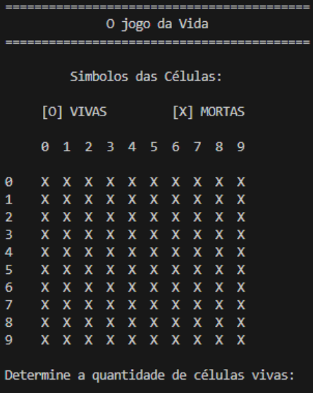

**Figura 1. Início do jogo da vida.**  

Caso seja inserido um valor inválido ou fora do intervalo de 1 a 100, uma mensagem de erro aparecerá e, em seguida, a pergunta será repetida, tal como percebido na Figura 2.  

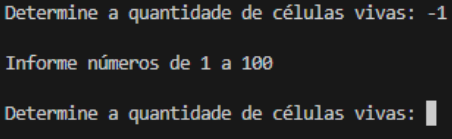

**Figura 2. Entrada inválida na quantidade de células.**  

Logo após determinar a quantidade de vivas, o programa irá solicitar os índices da célula que se deseja posicionar ou remover até preencher a quantidade desejada, conforme observado na Figura 3.  

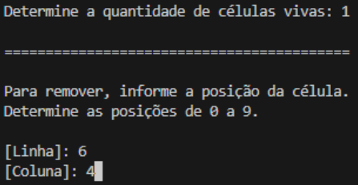

**Figura 3. Definição das Linhas e Colunas.**  

Quando um índice inexistente for inserido, o programa alertará o usuário e pedirá que insira novamente as coordenadas, de acordo com o que se nota na Figura 4.  

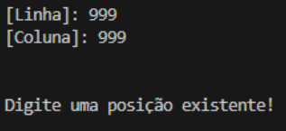

**Figura 4. Entrada inválida de índices.**  

Ao fim deste processo, o usuário será questionado se deseja inserir mais células na matriz, tal como percebido na Figura 5.  

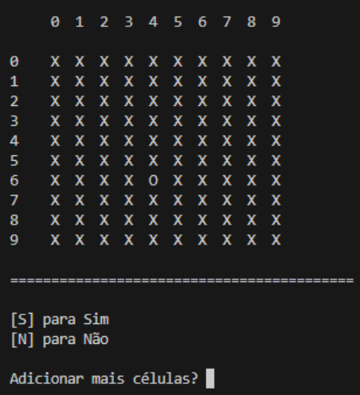

**Figura 5. Opção de inserir mais células.**  

Se a entrada não satisfazer as condições, o sistema irá solicitar a resposta até que seja inserida uma adequada, como evidenciado na Figura 6. 

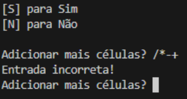

**Figura 6. Entrada inválida na opção de inserir mais células.**  

### 3.2. Saídas do programa  

Após todas as etapas serem concluídas, o jogo será iniciado, durante a sua execução o algoritmo evidenciará cada iteração que ocorre no tabuleiro, por meio das verificações realizadas da primeira até a última linha, da esquerda para a direita, deste modo, todos os vizinhos ao redor das células são analisados e contabilizados até chegar ao último elemento da matriz. Esse processo se repetirá, encerrando apenas quando todas as células do tabuleiro estiverem mortas. Para fins didáticos, as figuras a seguir exemplificam as possíveis situações na matriz.  

- **Solidão:** Uma célula viva que tenha menos de dois vizinhos vivos acaba morrendo.  

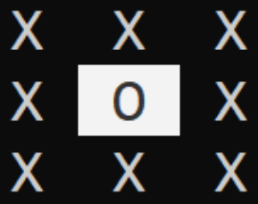

**Figura 7. Solidão**  

- **Sobrevivência:** Uma célula viva permanece viva quando possui dois ou três vizinhos vivos.  

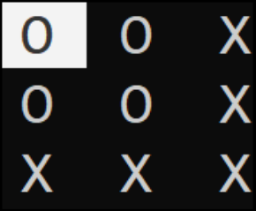

**Figura 8. Sobrevivência**  

- **Superpopulação:** Uma célula viva morre se tiver mais de três vizinhos vivos ao seu redor.  

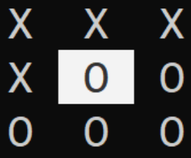

**Figura 9. Superpopulação**  

- **Reprodução:** Uma célula morta volta à vida quando exatamente três vizinhos ao redor estão vivos.  

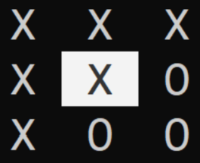

**Figura 10. Reprodução**  

- **Fim de jogo:** O jogo chega ao fim quando todas as células vivas do tabuleiro morrem.  

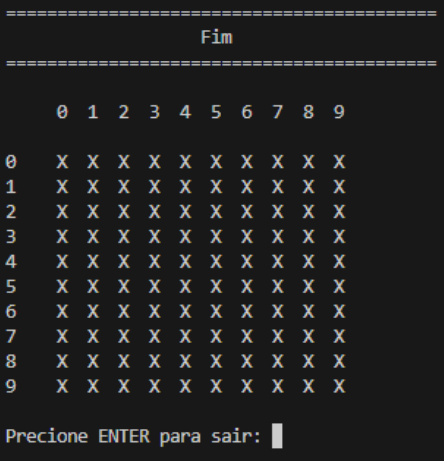

**Figura 11. Fim de jogo**  

**3.3. Testes e erros**  

No que se refere aos erros, durante o desenvolvimento foi possível identificar problemas relacionados à verificação de posições inexistentes. Isso ocorre porque o programa analisa todas as células ao redor para detectar os vizinhos, entretanto, quando uma célula está localizada nas bordas do tabuleiro, as verificações não são iguais às das células internas. Diante disso, a solução adotada foi delimitar a área de análise, e só então prosseguir com a verificação dos vizinhos.  

Outro problema identificado ocorreu quando o usuário repetia uma posição já ocupada, o que afetava diretamente a quantidade de células vivas declaradas no início do jogo. Ao fazer isso, a quantidade real de células ficava inferior à informada pelo usuário. A solução adotada foi implementar a funcionalidade de remover e realocar uma célula, a fim de garantir fidelidade às entradas fornecidas.  

**4. Conclusão**  

Em suma, este relatório tem como finalidade esclarecer o desenvolvimento do "Jogo da Vida" e todas as suas funcionalidades esperadas, como a utilização de módulos, o estabelecimento dos símbolos que representam os estados das células, a definição da imagem inicial de acordo com as entradas do usuário e a exibição de cada iteração na matriz enquanto houver células vivas no tabuleiro. Portanto, o software atende a todos os requisitos solicitados. Além disso, foi acrescentada a funcionalidade de remover uma célula e reposicionar no tabuleiro.  

**4.1. Melhorias**  

No que se refere às melhorias, é possível destacar a adição de células na matriz, uma vez que, o usuário tem que inserir manualmente uma a uma utilizando o teclado, uma implementação alternativa a esse método seria a opção de inserir de forma aleatória as posições.  

**5. Referências Bibliográficas**  

KHAN ACADEMY. Darwin, evolução e seleção natural. Disponível em:  
https://pt.khanacademy.org/science/ap-biology/natural-selection/natural-selection-ap/a/darwin-evolution-natural-selection. Acesso em: 22 abr. 2025.  

GUANABARA, Gustavo. Exercício Python #086 - Matriz em Python. YouTube, 2018. Disponível em: https://youtu.be/EGmIFdwD4C4. Acesso em: 10 abr. 2025.  