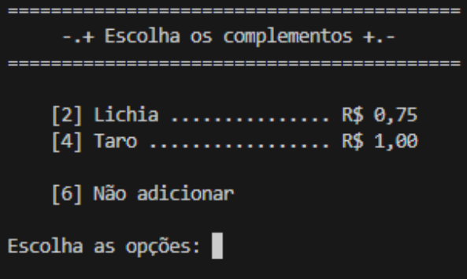

# Desafio Bubble Tea

**_Abstract._** _This report describes the development of a Python algorithm version 3.13.1 to manage Bubble Tea requests at Feira de Santana State University (UEFS), in partnership with the Feira de Santana Power Women's Cooperative (MPFSA). The system allows you to register customers, process orders with bases and complements, apply specific discounts and accumulate cashback. In addition, the program stores data persistently in .txt files and recovers information from registered customers._  

**_Resumo. Este relatório descreve o desenvolvimento de um algoritmo em Python versão 3.13.1 para gerenciar pedidos de Bubble Tea na Universidade Estadual de Feira de Santana (UEFS), em parceria com a cooperativa Mulheres Poderosas de Feira de Santana (MPFSA). O sistema permite cadastrar clientes, processar pedidos com bases e complementos, aplicar descontos específicos e acumular cashback. Além disso, o programa armazena dados persistentemente em arquivos .txt e recupera informações de clientes cadastrados._  

## 1. Introdução

Segundo a CNN Brasil (2024), o Bubble Tea foi inventado em 1980 e se tornou uma bebida muito apreciada pelos taiwaneses, devido ao seu sabor único, resultado da combinação de chás com bases de diversos sabores, como leite, maracujá, rosa e manga. Além disso, podem ser adicionados complementos, como boba, lichia, geleia, taro e chia, o que torna a bebida ainda mais refrescante. Nesse contexto, a Universidade Estadual de Feira de Santana (UEFS) e a cooperativa MPFSA (Mulheres Poderosas de Feira de Santana), considerando a popularidade dos chás de bolhas, decidiram trazer essa novidade para o campus da universidade.

Dessa forma, o local será aberto a toda comunidade, oferecendo benefícios especiais: 25% de desconto no valor do pedido para estudantes e desconto de R$1,00 para professores ou funcionários da UEFS. Além disso, cada cliente contará com um saldo de cashback que poderá ser utilizado em qualquer compra, funcionando da seguinte maneira, a cada pedido realizado, 10% do valor retorna ao cliente.

Sendo assim, com o objetivo de agilizar o atendimento ao público, surgiu a necessidade do desenvolvimento de um algoritmo que implemente o processamento de um pedido e o seu valor final, que ao ser fechado, armazene as informações dos usuários em um arquivo. Dessa forma, sempre que o programa for iniciado, ele poderá recuperar dados como nome, categoria e saldo dos clientes. A cada novo pedido, o sistema solicitará o nome do cliente e verificará nos registros se ele já está cadastrado. Caso esteja, suas informações como cashback e categoria serão recuperadas, caso contrário, um novo cadastro será realizado.

**1.1.** **Fundamentação teórica**

A fundamentação teórica do sistema se consolidou à medida que os requisitos foram compreendidos. Nesse contexto, o programa precisa lidar com a demanda de usuários, para isso, foi aplicado o conceito de programação orientada a objetos, que permite representar elementos do mundo real por meio de códigos. Dentro desse contexto, o cliente pode ser tratado como um objeto, com características como nome, categoria e saldo de cashback. Além disso, esses objetos são capazes de executar funções específicas. Essa abordagem permite simplificar o algoritmo, já que todos os usuários podem ser representados de maneira padronizada com base nesse modelo.

Ao longo do código, diversas tarefas se repetem, para evitar essas repetições, o uso de funções foi fundamental para o desenvolvimento do algoritmo. Com elas, é possível declarar um conjunto de instruções uma única vez e utilizá-las diversas vezes. Dessa forma, o código se torna mais organizado e estruturado, uma vez que, apenas basta chamar a função desejada quando for preciso.

Como dito anteriormente, o programa deve ser capaz de gerenciar os dados dos usuários do estabelecimento e armazená-los em um arquivo, sejam eles novos clientes ou recorrentes. Com base nisso, a abordagem adotada para essa tarefa foi a utilização de arquivos .txt, esse método foi escolhido com base na sua dinâmica de funcionamento ao ser chamado no programa principal, já que, ao trazer os dados do arquivo para o sistema, é possível transformá-los em estruturas conhecidas da linguagem Python, desse modo, facilitou-se o tratamento dos conteúdos dos usuários.

Nesse sentido, esse relatório tem como finalidade explicar o processo de desenvolvimento do algoritmo feito em Python versão 3.13.1, responsável por gerenciar os dados dos consumidores de Bubble Tea da UEFS de forma persistente e suas funcionalidades, além de detalhar a metodologia utilizada e apresentar os resultados e discussões.

## 2. Metodologia

Durante as sessões tutoriais, ficou claro que seria fundamental compreender os conceitos de persistência de dados e classes em Python para o desenvolvimento do algoritmo, uma vez que, ele precisaria utilizar arquivos e aplicar o conceito de objetos na implementação da solução, a qual, por sua vez, deve ser elaborada de forma organizada. Ademais, no que se refere às entradas e saídas do programa, deve ser levado em consideração o tipo mais adequado de acordo com a situação, visto que, ao se manipular arquivos, os tipos de dados precisam ser tratados antes de chegarem no resultado final, deste modo, o código deverá passar por sessões de teste, a fim de, identificar saídas incorretas e corrigi-las para se obter os resultados especificados no problema.

**2.1.** **Requisitos do programa**

- Cada pedido inclui apenas uma base de chá, que pode ser escolhida entre as seguintes opções: leite, maracujá, rosa ou manga. Os preços correspondentes a cada uma estão indicados a seguir.

| Base      | Preço (R$) |
|-----------|------------|
| Leite     | 4,35       |
| Maracujá  | 4,60       |
| Rosa      | 5,85       |
| Manga     | 5,47       |

- Um pedido pode conter nenhum, um ou vários complementos. As opções disponíveis são: boba, lichia, geleia, taro e chia. Os preços de cada item estão indicados a seguir.

| Complementos | Preço (R$) |
|--------------|------------|
| Boba         | 0,50       |
| Lichia       | 0,75       |
| Geleia       | 0,65       |
| Taro         | 1,00       |
| Chia         | 0,35       |

- O espaço estará disponível para visitação e consumo por toda a comunidade. No entanto, clientes que forem estudantes da UEFS terão direito a um desconto de 25% sobre o valor total do pedido. Já professores e servidores da UEFS receberão um desconto de R$1,00 no valor final.

- Cada cliente acumula um saldo de cashback. A cada compra realizada, 10% do valor do pedido é devolvido como crédito, que poderá ser utilizado em futuras compras.

- Antes de concluir o pedido, são exibidos ao cliente o valor total da compra, o saldo atual de cashback e uma pergunta sobre o desejo de utilizá-lo naquele momento.

- Ao término do pedido, o sistema deve apresentar o valor final da compra em reais, com exibição de duas casas decimais.

**2.2. Descrição do algoritmo**

Nesta seção, serão detalhadas as abordagens utilizadas para o desenvolvimento do sistema de compras dos chás de bolhas da UEFS.

**2.2.1. Bibliotecas utilizadas**

1. **time**: Usada para atrasar os avisos na tela por 1.0 segundos;  
2. **os**: Utilizada para limpar o terminal de acordo com o sistema operacional, cls para o Windows e clear para Linux ou Mac.

**2.2.2.** **Classes criadas**

1. **Usuario**: Essa classe é responsável por representar o objeto cliente e definir suas características, sendo elas, nome, categoria e saldo de cashback. Além disso, ela é capaz de receber um nome digitado pelo usuário, a partir disso, é realizada uma consulta nos registros do estabelecimento de Bubble Tea da UEFS e caso o usuário já esteja cadastrado no banco de dados, suas informações serão resgatadas para dar continuidade a compra, caso contrário, um novo usuário será cadastrado.

2. **Pedido**: Tem como finalidade definir os pedidos dos clientes, considerando o tipo de base do chá e os seus complementos escolhidos pelo usuário. No que se refere às funcionalidades desse objeto, ele será capaz de processar o valor total do pedido conforme as escolhas do cliente e exibir todas as informações na tela, incluindo os descontos especiais e a opção de utilizar o saldo de cashback no final da compra.

**2.2.3.** **Funções criadas**

1. **arquivo()**: Ao inicializar o programa, essa função verifica se existem registros anteriores de clientes salvos. Se existirem, esses dados serão recuperados para o uso no sistema, caso contrário, isso indica que se trata da primeira execução do algoritmo, portanto, não existem dados anteriores.

2. **gravar(dados)**: Ao final do programa, essa função tem como finalidade gravar os dados dos clientes em um arquivo .txt, garantindo que as informações sejam mantidas e atualizadas para execuções futuras.

3. **título(textos)**: Centraliza as informações dos títulos.  
4. **limpar()**: Mantém somente as informações atuais na tela.  
5. **historico()**: Lê o arquivo .txt que contém as informações referentes aos históricos de pedidos, caso exista, ele retorna essas informações ao programa principal para exibição ao usuário.  
6. **gravar_historico(registros)**: Acessa o arquivo .txt que armazena as informações dos históricos de pedidos e adiciona ao final novos registros, dessa forma, mantém o arquivo sempre atualizado, caso seja solicitado a exibição.

**2.3.** **Ordem de codificação**

O desenvolvimento do algoritmo se desenvolveu à medida que novos conhecimentos foram adquiridos.

1. Em primeira análise, ao iniciar o programa, ele deve ser capaz de recuperar as informações passadas, entretanto, para evitar erros, foi feito uma verificação para descobrir se o arquivo .txt que armazena as informações dos clientes existe no local de execução do código, visto que, os dados serão utilizados nos processos seguintes, caso não exista, ao final da execução do algoritmo será criado;

2. Definição do menu principal e de suas opções: compra de chás de bolhas, visualização do histórico e encerramento do programa;

3. Construção do objeto cliente através dos dados armazenados no arquivo .txt e identificar se o usuário já está registrado no sistema para retornar as suas informações, contudo, se ele não estiver na base de dados, um novo cliente será cadastrado;

4. Criação do objeto pedido e suas funcionalidades, assim como, realização do pedido e processamento dos valores da base e complementos;

5. Consideração dos descontos especiais de categoria e saldos dos clientes;  
6. Atualizar os saldos de cashback dos usuários após uma compra;  
7. Gravar os históricos de pedidos.

### 2.4. Ferramentas

Este software foi criado em Python versão 3.13.1 e desenvolvido no sistema operacional Windows 10 de 64 bits, da Microsoft, dentro de um ambiente de desenvolvimento integrado (IDE). Para a programação, foi utilizado o Visual Studio Code (VS Code), um editor de código também desenvolvido pela Microsoft. Apesar de ter sido desenvolvido no Windows, o software pode ser executado nos sistemas operacionais Linux e macOS.

### 3. Resultados e Discussões

Nesta seção, serão fornecidas orientações sobre o manual de uso, com o objetivo de assegurar o uso adequado do sistema e ressaltar pontos importantes, como os dados de entrada e os erros corrigidos.

### 3.1. Manual de uso

Para rodar o programa, é essencial que um interpretador Python versão 3.13.1 ou superior esteja instalado no computador. Além disso, o programa utiliza os módulos time e os, que fazem parte da biblioteca padrão da linguagem. Abaixo está um guia passo a passo para a execução do sistema:

1. Abra o interpretador Python.  
2. Acesse, no interpretador, o diretório onde o código-fonte está salvo.  
3. Execute o código.  

Por conseguinte, o programa será inicializado carregando todos os dados existentes e, em seguida, exibirá as opções do menu, cada uma associada a um número específico para sua respectiva ação, conforme ilustrado na Figura 1.

**Figura 1. Menu principal do algoritmo e suas funções.**

Deste modo, ao digitar 1 no teclado, o usuário será direcionado para a opção "Comprar". Em seguida, deverá informar seu nome, e o programa verificará se sua identificação consta nos dados do estabelecimento. Caso conste, suas informações serão resgatadas, caso contrário, será necessário realizar o cadastro no sistema, tal como percebido na Figura 2.

**Figura 2. Identificação do usuário.**

Sob esse viés, caso a identificação do usuário não seja encontrada no sistema, ele deverá informar, por meio dos números associados, a qual categoria pertence para realizar o seu cadastro no estabelecimento, somente após isso, dará seguimento para a realização do pedido, conforme observado na Figura 3.

**Figura 3. Cadastramento de novos usuários.**

Nesse sentido, usuários já cadastrados serão diretamente encaminhados para a realização do pedido, de acordo com o que se nota na Figura 4 e 5.

**Figura 4. Usuário registrado no estabelecimento.**

**Figura 5. Opções de base para o Chá.**

Logo após a escolha do cliente, ele deverá selecionar quais complementos irão acompanhar a base do seu chá de acordo com os números correspondentes. Vale destacar que só será possível escolher um complemento de cada sabor, deste modo, o programa irá inviabilizar a seleção de complementos já escolhidos, tal como percebido na Figura 6 e 7.

**Figura 6. Opções de complementos para o Chá.**

**Figura 7. Opções de complementos limitados.**

Somente se o cliente insistir em adicionar um complemento já selecionado, um aviso será exibido na tela, como evidenciado na Figura 8.

**Figura 8. Aviso de complemento já inserido.**

Dessa maneira, ao realizar a escolha dos sabores, o resumo do pedido será exibido ao cliente. Caso o saldo de cashback seja maior que zero, o sistema perguntará se ele deseja utilizá-lo, conforme demonstrado nas Figuras 9 e 10.

**Figura 9. Resumo do pedido com cashback zerado.**

**Figura 10. Utilização do cashback opcional.**

De acordo com os requisitos, ao processar o pedido o programa deve perguntar se o usuário deseja utilizar o seu saldo de cashback, caso a resposta seja sim, o valor total é subtraído do cashback disponível, como mostrado na Figura 11.

**Figura 11. Cashback utilizado.**

Deste modo, ao encerrar o pagamento do pedido, o atendente é questionado se deseja processar um novo pedido, caso a resposta seja sim, o programa retornará ao menu principal, caso a resposta seja não, o sistema se encerra, como visto na figura 12.

**Figura 12. Questionamento de continuidade do programa.**

Na tela inicial, ao selecionar a opção de histórico de pedidos, serão exibidas todas as compras de Bubble Teas efetuadas no programa, conforme ilustrado na Figura 13.

**Figura 13. Histórico de pedidos.**

Dessa forma, ao selecionar a opção de sair no menu principal, todas as informações serão salvas em um arquivo .txt, garantindo a persistência dos dados e o correto funcionamento do sistema. Somente após esse processo o algoritmo será encerrado.

**3.2. Saídas do programa**

As saídas do programa são geradas a partir do processamento dos pedidos, os quais são diretamente influenciados pelas informações dos clientes. Cada categoria exige um tratamento específico, estudantes da UEFS têm direito a um desconto de 25% sobre o valor total, professores e funcionários recebem um desconto fixo de R$1,00 e os clientes que não pertencem a esses grupos não recebem descontos especiais. No entanto, todos os usuários acumulam saldos de cashback ao final de cada pedido, correspondentes a 10% do valor total, que podem ser utilizados ou não em compras futuras.

**3.3. Testes e erros**

No que se refere aos erros, ao longo do desenvolvimento do sistema, foram identificados erros como o FileNotFoundError, que ocorre quando se tenta abrir um arquivo que não está no diretório especificado, TypeError, que ocorreu ao se utilizar um método que funciona com um número do tipo float em uma string, e o IndexError, que aconteceu ao tentar acessar um elemento em uma posição inexistente de uma lista. Diante disso, foi necessário realizar o tratamento de dados em cada situação específica do código para solucionar os erros.

**4. Conclusão**

Em suma, este relatório tem como finalidade esclarecer o desenvolvimento do sistema de pedidos do estabelecimento de Bubble Tea na UEFS, bem como apresentar todas as suas funcionalidades esperadas, como a utilização de módulos, persistência de dados, cadastramento de usuários, aplicação de descontos por categoria e armazenamento de saldos de cashback. Portanto, o software atende a todos os requisitos solicitados. Além disso, foi acrescentada a funcionalidade de ver o histórico de pedidos.

**5. Referências Bibliográficas**

WONG, Maggie Hiufu. _Bubble tea: conheça a origem de uma das bebidas mais populares de Taiwan_. CNN Brasil, 26 out. 2024. Disponível em:  
https://www.cnnbrasil.com.br/viagemegastronomia/gastronomia/bubble-tea-conheca-a-origem-de-uma-das-bebidas-mais-populares-de-taiwan/. Acesso em: 27 maio. 2025.

PROFESSOR JUST. Python #22 - Arquivos. YouTube, 25 jun. 2020. Disponível em:  
https://youtu.be/YTFYS-mjKFw. Acesso em: 16 maio. 2025.

PROFESSOR JUST. Python #23 – Arquivos na Lista de Convidados. YouTube, 30 jun. 2020. Disponível em:  
https://youtu.be/O2-bEZ4W6J4. Acesso em: 16 maio. 2025.

HASHTAG PROGRAMAÇÃO. Como funcionam classes e programação orientada a objetos em Python – Aprenda em 10 minutos!. YouTube, 1 dez. 2022. Disponível em:  
https://youtu.be/97A_Cyyh-eU. Acesso em: 20 maio. 2025.

HASHTAG PROGRAMAÇÃO. Como sair do zero em classes no Python – Self e Init explicados. YouTube, 27 nov. 2021. Disponível em:  
https://youtu.be/gomDSZaay3E. Acesso em: 20 maio. 2025.
